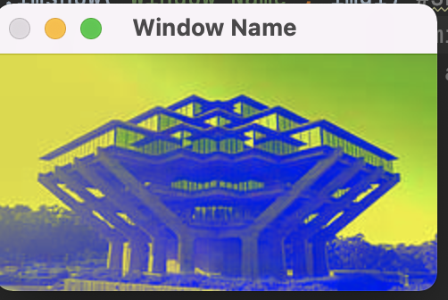
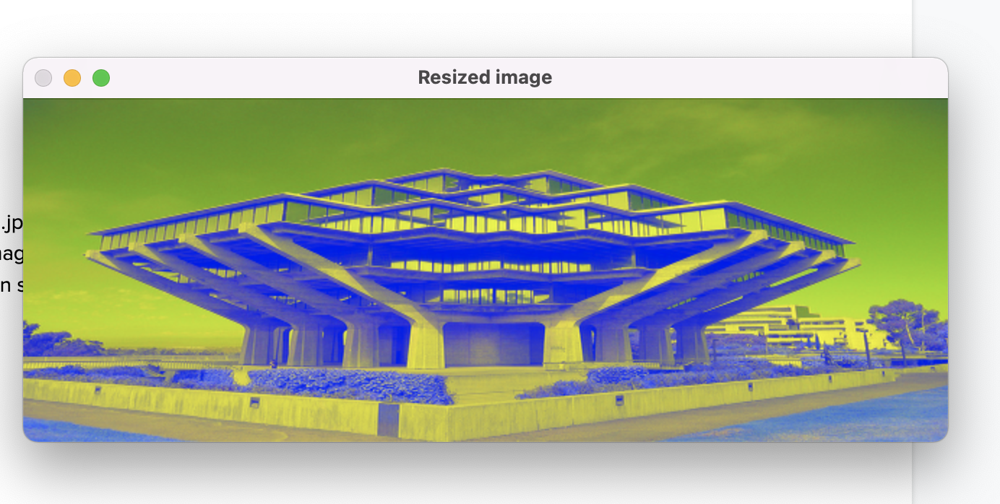
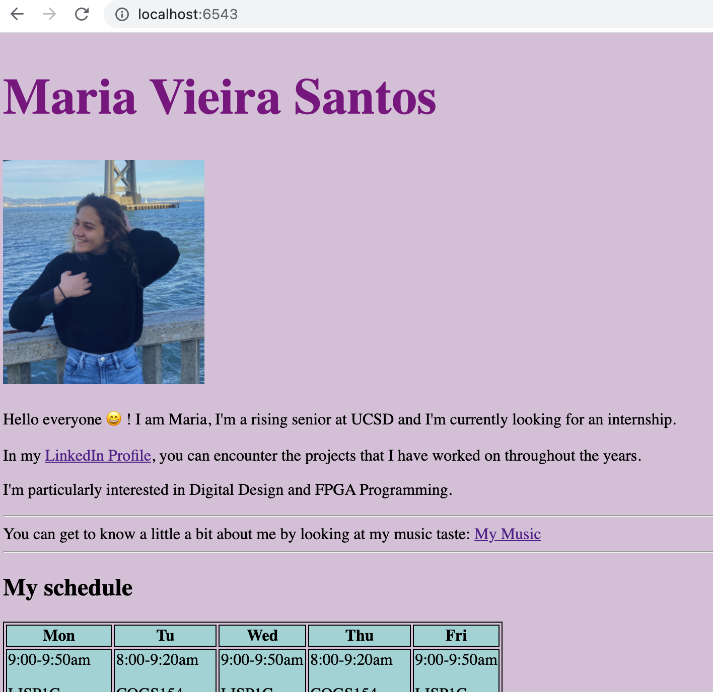
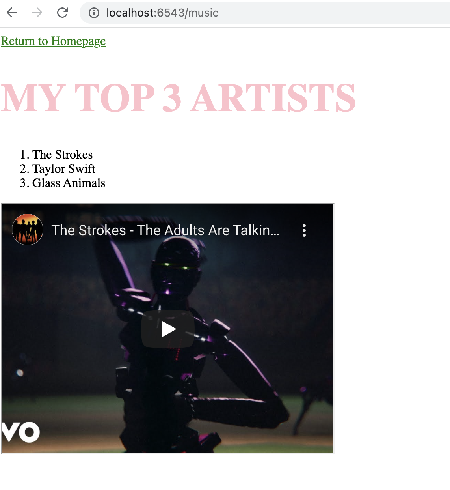

## LAB 3
 
### Tutorial 1
In this tutorial, we learned how to use the numpy library for manipulating arrays.

### Tutorial 2
Here, we learned how to use opencv to make changes to images.

Question 1

Question 2

### Tutorial 3
For this tutorial, we created our own web server and hosted a webpage on it. In order to accomplish this, we used a Web Framework called Pyramid.

### Tutorial 4
This tutorial helped us understand the concept of REST that consists on using the web server as a source of data.

###Challenge 1
For this challenge, I learned how to host my own portfolio on the server using the portfolio created on Lab 1.
We were taught how to create routes to other pages. In this case, we created 2 routes: /home, the home directory, that pointed to index.html and /music that pointed to music.html.

###Challenge 2
For this challenge, we hosted a webpage called Triton Gallery that took inputs from the client, using HTML and RESTful resources.
The webpage had two buttons: 
Display: that when clicked prompted the webpage to display an image of Geisel according to the input 1-5;
Price: that when clicked displayed the price according to the input.

On the Javascript end, I created two functions : click_display() and click_price() that wrote to HTML the price and the image. 
On app.py I created the function get_price that computed the price according to the input and get_photos that would get the correct image file according to the input.
