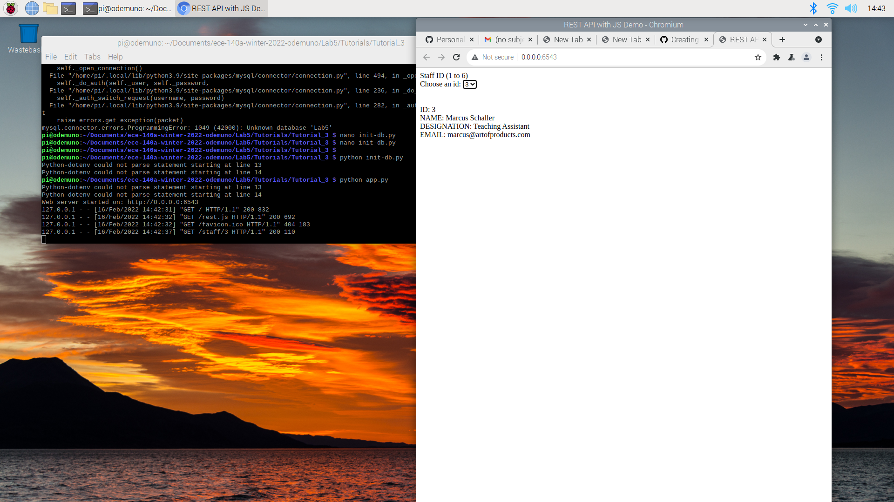
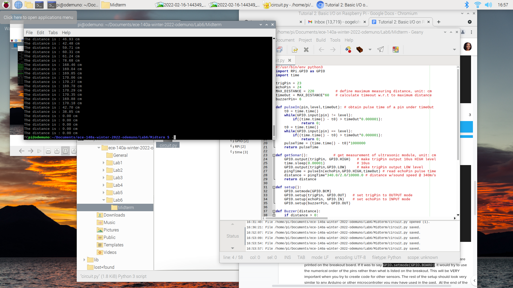
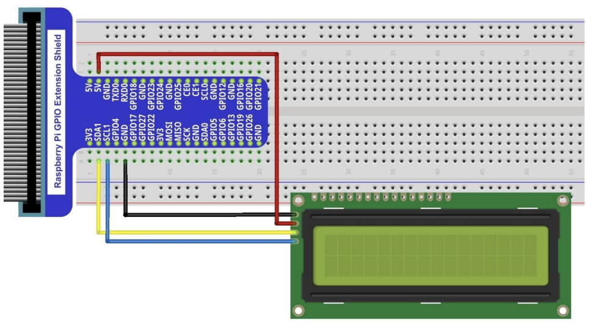
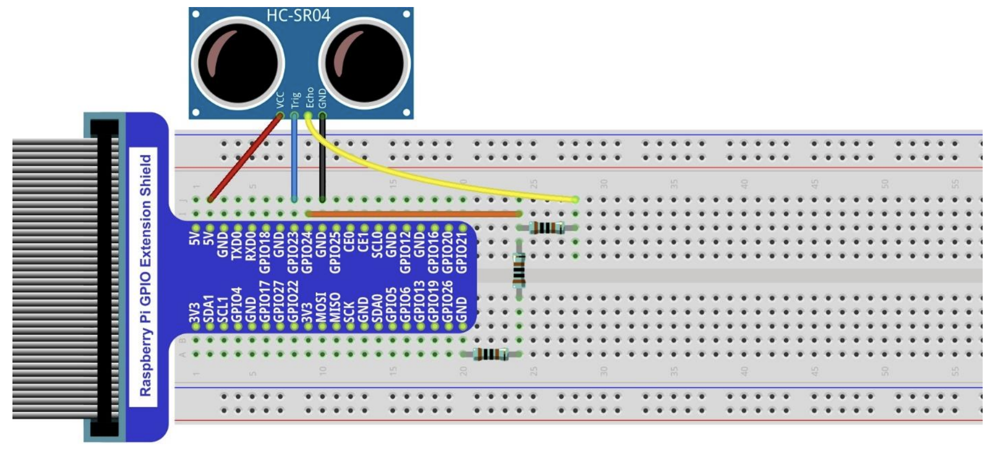
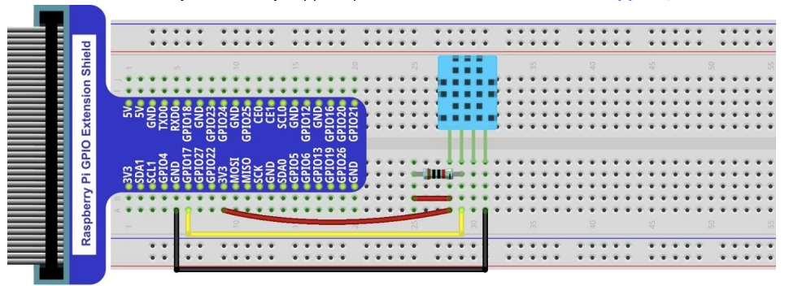
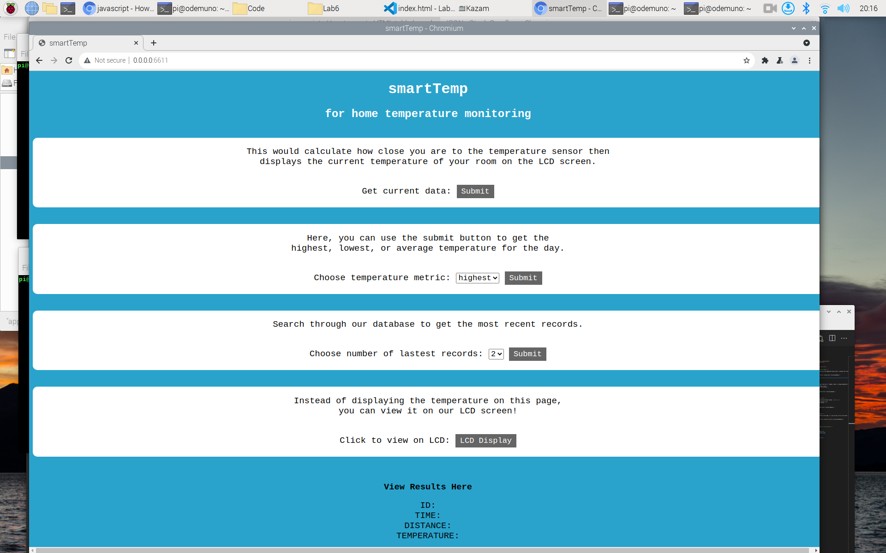

# Lab 6 (midterm) 
## Lab Partners: Odemuno Ogelohwohor A15397324 and Maria Santos A15616273

This is the midterm for the class. The objective of this lab is to work with hardware (Raspberry Pi) and software (SQL, HTML, JS, CSS). There are 2 tutorials and 1 challenge:

1. Tutorial 1: Setup Raspberry Pi
2. Tutorial 2: Basic I/O
3. Challenge 1: Midterm

### Tutorial 1: Setup Raspberry Pi
> DISCLAIMER: We both had Mac OS systems so if you are using MacOS, the software setup would be significantly more difficult for you :) 

- Flash the SD card using your Mac - it would be best to use an ethernet cable or connect using your home wifi
- To follow though with the setup process aligned in the tutorial document: use a monitor, an external keyboard and mouse. 
- After you have reached the point of cloning your repo, generate your personal access token to sign in
- Install the required files using these commands:
    - `pip install mysql-connector-python`
    - `pip install python-dotenv`
    - `pip install pyramid`
- Then run your code!

This is our screenshot of running the Lab 5 Tutorial 3 code:

### Tutorial 2: Basic I/O
The tutorial by Freenove was very useful in understanding how the motion sensor worked. From this tutorial,these were our takeaways:
- To make sure it was working:
    - We changed the maximum distnce 
    - Checked if the pins were properly wired
- Sensors can work effectively together
- The orientation of some circuit components are highly important

This is our screenshot of running the your motion sensor and buzzer code:

## Project Description
Our project is called **smartTemp**. It tells you how close you are to our temperature sensor and displays the current temperature of your room on the LCD screen. We followed the tutorial documentation for the RaspberryPi kit to set up the circuit [(view pdf)](https://github.com/Freenove/Freenove_Ultimate_Starter_Kit_for_Raspberry_Pi/blob/master/Tutorial.pdf).

To design the Raspberry Pi circuit, we used the following components:

- **I2C LCD1602 Display Screen** (OUTPUT): This integrates a I2C interface, which connects the serial-input & parallel-output module to the LCD1602 Display Screen. We will use this to display the temperature and distance with the current date-time measurement.

- **Ultrasonic Ranging HC SR04** (INPUT): This sensor measures distance. We will use this to calculate the distance to the observer who wants to read the temperature value. 

- **Hypothermograph DHT11** (INPUT): This sensor reads the humidity and temperature values in our environment. We will select only the temperature value from the reading.

## Midterm Code Files
Our project is organized as follows: `Lab6/images`, `Lab6/Midterm` and `README.md`.
- `Lab6/images` contains all the images in this README document.

### `Lab6/Midterm` 
This contains two folders:
- `Midterm/Code`
  - this contains all our code to get our project running
- `Midterm/Freenove_Ultimate_Starter_Kit...`
  - this is the folder we cloned form the Freenove github repo

#### `Midterm/Code`
This folder contains the `public` folder and a bunch of other files:
- `public`
  - `rest.js`: to post/fetch the data
  - `styles.css`: for the html styling
- `credentials.env`: with the key to be able to run SQL
- `init-db.py`: to initialize the database
- `app0.py`: to collect sensor data from at least 2 input sensors and store them in a SQL table
- `app.py`: to interact with elements on the webpage
- `index.html`: template for our home webpage
- Other files for Raspberry Pi sensors: 
  - `Freenove_DHT.py`: for the temperature sensor
  - `Adafruit_LCD1602.py`: for the LCD display
  - `PCF8574.py`: for the Raspberry GPIO

## Project YouTube Video
Link: [https://youtu.be/Z1TNE2TS7Rc](https://youtu.be/Z1TNE2TS7Rc)

Goals:
1. Collect sensor data from at least 2 input sensors
2. RESTful route to get data from sensors and display on the page
3. Use input elements for 2 SQL queries
4. Use an input web element to produce a repsonse on the LCD display

This is our final product:

## Instructions 
1. Run python init-db.py (to create database Lab6 and table SensorData)
2. Run python app0.py (to insert the sensor values into the table)
3. Simultaneously run app0.py and app.py. They will work together to enter live data onto the webpage by querying the database the is being updated by app0.py.
4. Type 'localhost:6543' into your browser to see the website 